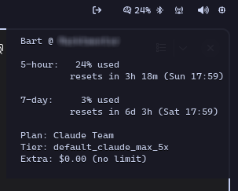

# claude-usage

A lightweight waybar/polybar module to monitor your Claude Code usage limits using Bun.

This is a fork of [bartvanvliet/claude-usage](https://github.com/bartvanvliet/claude-usage.git).



## Features

- Shows 5-hour and 7-day usage percentages in your status bar
- Hover tooltip with detailed info (reset times, plan, tier)
- Desktop notifications at 50%, 80%, 90%, and 95% thresholds
- Color-coded status (normal, warning, critical)
- Click to open Claude usage dashboard
- Compiles to a single standalone executable (no runtime dependencies)

## Requirements

- [Bun](https://bun.sh) (required for script install, or just for building binary)
- `notify-send` (libnotify) for desktop notifications
- Claude Code CLI or OpenCode authenticated
- Waybar or Polybar

## Installation

```bash
# Clone the repo
git clone https://github.com/denniseijpe/claude-usage-waybar-bun.git
cd claude-usage-waybar-bun
```

### Option 1: Script (requires Bun runtime)

Installs the TypeScript source directly. Smaller file size (~10KB), but requires Bun to be installed on your system.

```bash
bun run install
```

### Option 2: Standalone Binary (no runtime dependencies)

Compiles to a self-contained executable (~100MB). No runtime dependencies needed after installation.

```bash
bun run install-binary
```

Both options install to `~/.local/bin/claude-usage`.

## Development

```bash
# Run directly without building
bun run dev

# Build only (outputs to dist/claude-usage)
bun run build
```

## Waybar Configuration

Add to your `~/.config/waybar/config.jsonc`:

```jsonc
{
  "modules-right": [
    "custom/claude-usage",
    // ... other modules
  ],

  "custom/claude-usage": {
    "exec": "~/.local/bin/claude-usage",
    "return-type": "json",
    "interval": 300,
    "on-click": "xdg-open https://claude.ai/settings/usage",
    "on-click-right": "pkill -SIGRTMIN+9 waybar",
    "signal": 9
  }
}
```

Add to your `~/.config/waybar/style.css`:

```css
#custom-claude-usage {
  padding: 0 7.5px;
}

#custom-claude-usage.warning {
  color: #d4a656;
}

#custom-claude-usage.critical {
  color: #a55555;
}

#custom-claude-usage.error {
  color: #a55555;
  opacity: 0.6;
}
```

## Mako Notification Styling (Optional)

Add to your `~/.config/mako/config`:

```ini
[app-name=Claude]
border-color=#d4a656

[app-name=Claude urgency=critical]
border-color=#a55555
background-color=#302030
```

## How It Works

The executable reads OAuth credentials from one of the following sources (in order):

1. **Claude Code CLI**: `~/.claude/.credentials.json`
2. **OpenCode**: `~/.local/share/opencode/auth.json`

It checks token expiration and uses the first valid token found, then calls the Anthropic API:

- `GET https://api.anthropic.com/api/oauth/usage` - Usage percentages and reset times
- `GET https://api.anthropic.com/api/oauth/profile` - Account and organization info

Notification state is stored in `~/.cache/claude-usage-state.json` to prevent duplicate alerts.

## Output Format

The executable outputs waybar-compatible JSON:

```json
{
  "text": "󰧑  19% ",
  "tooltip": "John Doe\n\n5-hour:   19% used\n         resets in 3h 45m (Sun 17:59)\n\n7-day:     3% used\n         resets in 6d 3h (Sat 17:59)\n\nPlan: Claude Team\nTier: default_claude_max_5x\nExtra: $0.00 (no limit)",
  "class": "normal",
  "percentage": 19
}
```

## Credits

Inspired by [CodexBar](https://github.com/steipete/CodexBar) - a macOS menu bar app for tracking Claude/Codex usage.

Forked from [bartvanvliet/claude-usage](https://github.com/bartvanvliet/claude-usage.git).

Vibe coded with [OpenCode](https://opencode.ai) and Claude Opus 4.5.

## License

MIT
